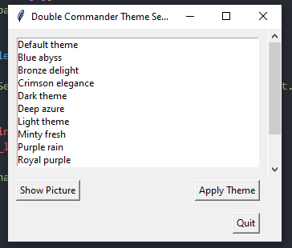
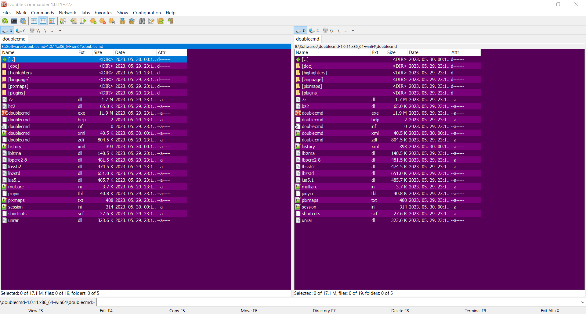
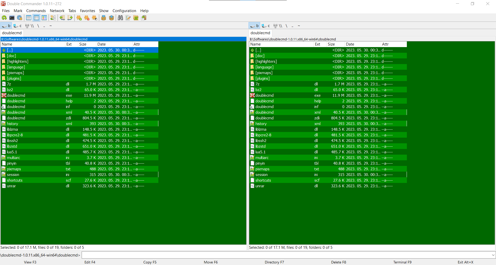
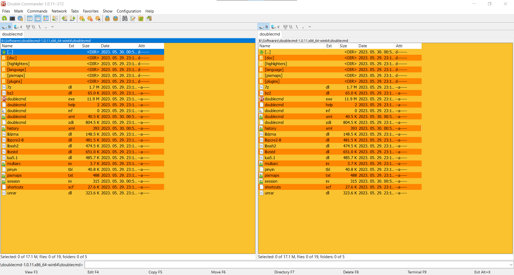
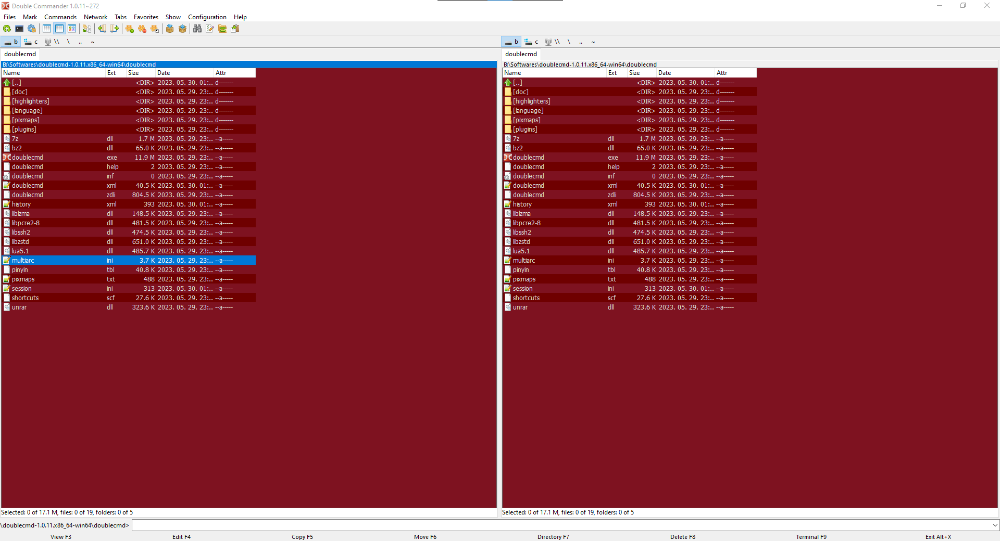
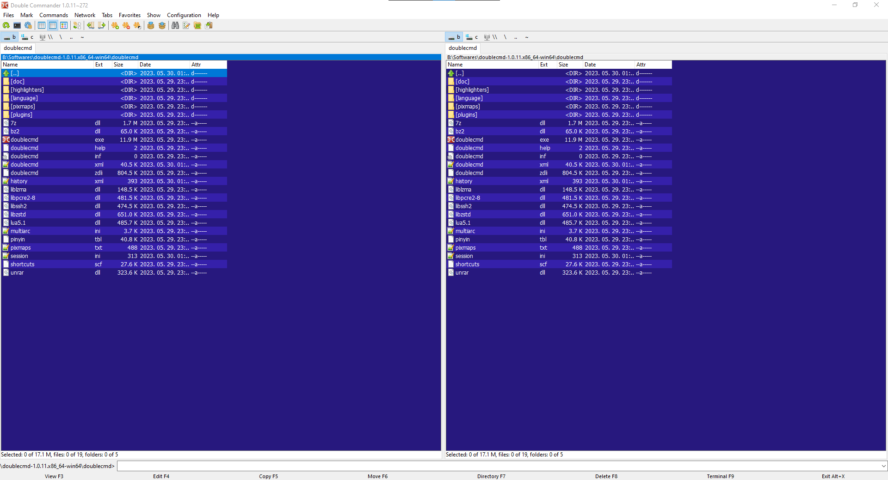
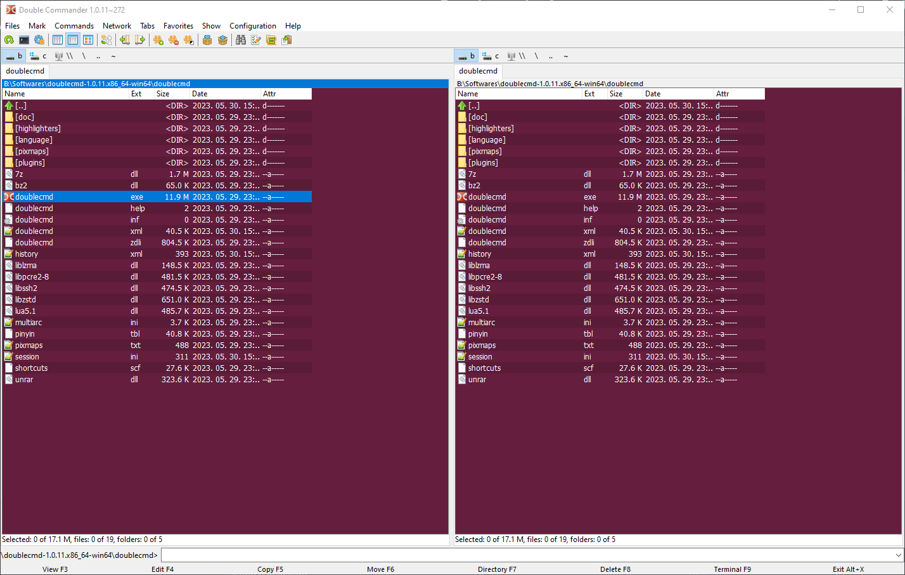
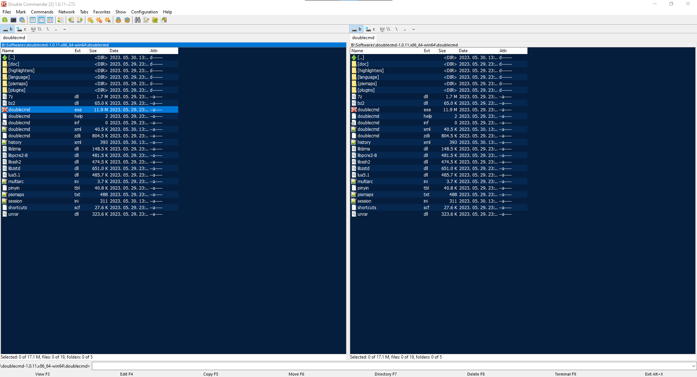
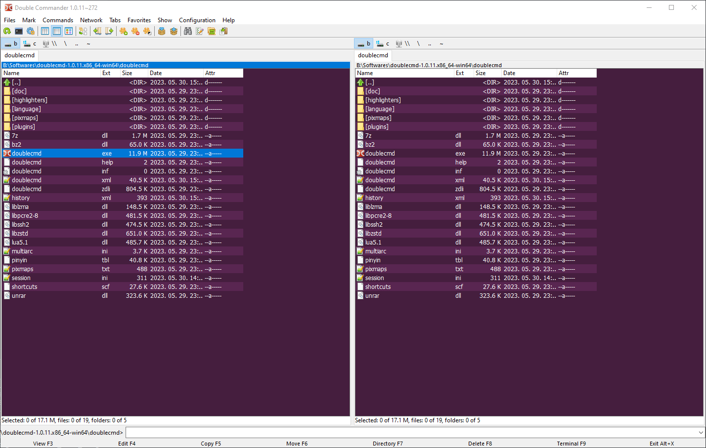
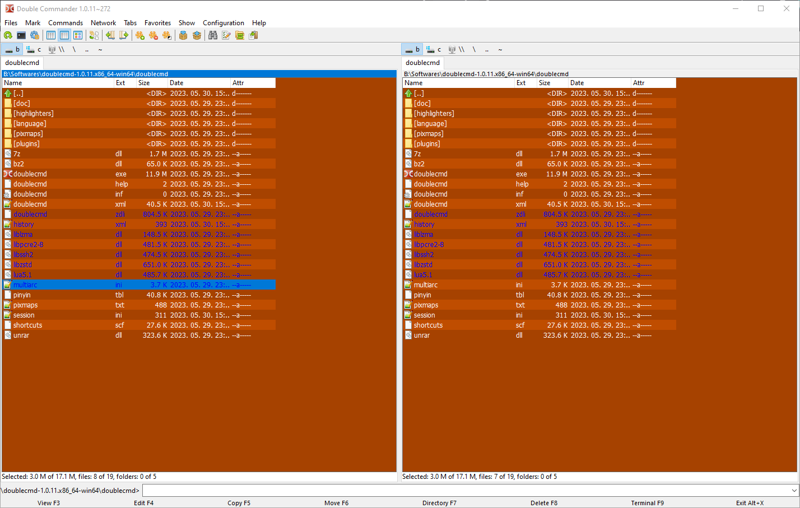

# Double Commander theme changer app

---

The Double Commander Theme Changer is a Python application that allows you to easily change the theme of the Double Commander file manager. With this app, you can select a theme from a list, preview the theme picture, and apply the selected theme to Double Commander.

## GUI



## Themes

| `Dark` | `Light` |
|-----------------|--------------------|
|  |  |
| `Purple rain` | `Minty fresh` |
|  |  |
| `Olive branch` | `Saffron sunset` |
|  |  |
| `Ruby velvet` | `Deep azure` |
|  |  |
| `Crimson elegance` | `Blue abyss` |
|  |  |
| `Royal purple` | `Bronze delight` |
|  |  |

## Usage

Use one of the [Releases](https://github.com/delington/Double-Commander-Theme-Changer/releases) (only Windows) or install as a `python app`:

1. Clone or download this repository to your local machine.

    ```bash
    git clone https://github.com/delington/Double-Commander-Theme-Changer.git
    ```

2. Navigate to the project directory.

   ```bash
   cd Double-Commander-Theme-Changer
   ```

3. Install dependencies

    ```bash
    pip install -r requirements.txt
    ```

4. Launch the Double Commander Theme Changer by running the following command:

    ```javascript
    python main.py (made with python3 version 3.11.3, also tested with python 3.10.5)
    ```

### Previous (console) usage:

```
Theme Options:
0. Exit
1. Dark theme
2. Default theme
Select a theme option (1-2):
```

    3. Enter the corresponding number for the theme you want to apply. For example, enter '1' to select the Dark theme.

    4. Optionally, you can choose to preview the theme picture. When prompted, enter 2 to show the picture, if there is one.

    5. The selected theme will be applied to Double Commander.

    6. To exit the app, enter '0' when prompted to select a theme option.

## Theme Options File

The theme options for the Double Commander Theme Changer are stored in a JSON file called `themes.json`. The file contains an array of objects, where each object represents a theme with the following properties:

```javascript
[
  {
    "name": "Dark theme",
    "file_path": "properties/colors/dark_theme.xml",
    "picture_path": "properties/colors/dark_theme.png"
  },
  {
    "name": "Default theme",
    "file_path": "properties/colors/default_theme.xml",
    "picture_path": "properties/colors/default_theme.png"
  }
]

```

You can customize the `themes.json` file to add, remove, or modify themes as per your requirements. Make sure to provide the correct file paths for the theme XML files and picture files.

## Contributing

Contributions are welcome! If you have any suggestions, bug reports, or feature requests, please open an issue on the GitHub repository. You can also submit pull requests with proposed changes.

## License

This project is licensed under the MIT License.

## Acknowledgements

The Double Commander file manager: https://doublecmd.sourceforge.io/